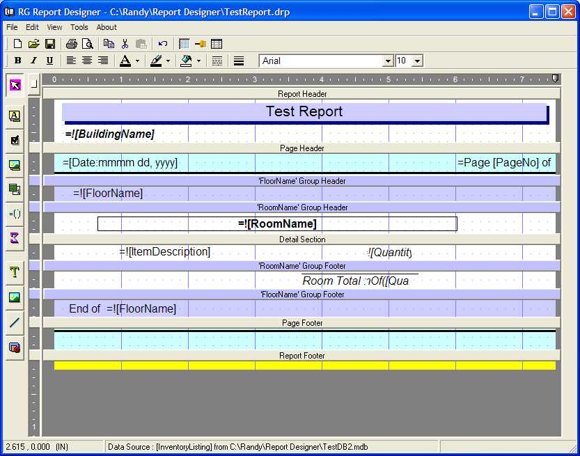



## Report Designer \(Final Update \- Really\!\)

### Description

UPDATE 11/07/2006 - Now has TEST GROUP for easier testing without compile. Added 'Start New Page' option to group headers, fixed various bugs with opening saved files, further fixes to undo.

UPDATE 10/26/2006 - Mainly fixed up Undo (removed Redo) plus other minor bug fixes

UPDATE 10/19/2006 - Further improvements to GUI, coolbar control, better icons

UPDATED 10/12/2006 - Group Headers/Footers, new selection modes, bug fixes, etc.

This is a project I WAS working on for a long while but never did complete. I'm uploading it mainly for the interface example that may be of help to others. You can create and preview simple reports. *** IMPORTANT *** Please read the Readme.doc before using this program.
 
### More Info
 
PLEASE NOTE : This application requires the Ramosoft print preview dll. I have included the source for it, which must be compile and referenced in this project in order to use the print preview. I have made some modifications to the original print preview code.

             |
---                |---
**Submitted On**   |2006-11-07 08:25:28
**By**             |[Randy Gomez](https://github.com/Planet-Source-Code/PSCIndex/blob/master/ByAuthor/randy-gomez.md)
**Level**          |Intermediate
**User Rating**    |5.0 (170 globes from 34 users)
**Compatibility**  |VB 6\.0
**Category**       |[Databases/ Data Access/ DAO/ ADO](https://github.com/Planet-Source-Code/PSCIndex/blob/master/ByCategory/databases-data-access-dao-ado__1-6.md)
**World**          |[Visual Basic](https://github.com/Planet-Source-Code/PSCIndex/blob/master/ByWorld/visual-basic.md)
**Archive File**   |[Report\_Des2029591172006\.zip](https://github.com/Planet-Source-Code/randy-gomez-report-designer-final-update-really__1-66588/archive/master.zip)

